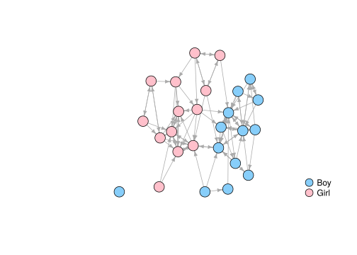

<!-- README.md is generated from README.Rmd. Please edit that file -->

# `netseg`: Measures of Network Segregation and Homophily 

<!-- badges: start -->

<!-- badges: end -->

This is an R package implementing most important descriptive measures of
homophily and segregation in social networks. See Bojanowski & Corten
(2014) for a review.

## Installation

<!--
You can install the released version of netseg from [CRAN](https://CRAN.R-project.org) with:

``` r
install.packages("netseg")
```
-->

The development version from [GitHub](https://github.com/) with:

``` r
# install.packages("remotes")
remotes::install_github("mbojan/netseg")
```

## Example

To illustrate, consider the Classroom network below:

``` r
library(netseg)
library(igraph)
#> 
#> Attaching package: 'igraph'
#> The following objects are masked from 'package:stats':
#> 
#>     decompose, spectrum
#> The following object is masked from 'package:base':
#> 
#>     union

data("Classroom")

plot(
  Classroom,
  layout = graphlayouts::layout_with_stress,
  vertex.color = c("pink", "lightskyblue")[match(V(Classroom)$gender, c("Girl", "Boy"))],
  vertex.label = NA,
  edge.arrow.size = 0.5
)
legend(
  "bottomright",
  pch = 21,
  legend = c("Boy", "Girl"),
  pt.cex = 2,
  pt.bg = c("lightskyblue", "pink"),
  col = "black",
  bty = "n"
)
```



The extent of gender segregation in this network can be assessed using
one of the indices provided in the package, for example odds ratio of
within-group tie (`orwg()`)

``` r
orwg(Classroom, "gender")
#> [1] 16.58071
```

tells us that within-gender ties are 16.580705 times more likely than
between-gender ties. Coleman’s index (Coleman 1958) assesses the
segregation on the group level:

``` r
coleman(Classroom, "gender")
#>       Boy      Girl 
#> 0.9084249 0.7909699
```

Qualitatively speaking it compares the proportion of same-group
neighbors to the proportion of that group in the network as a whole. It
is a number between 0 and 1. Value of 0 means these proportions are
equal. Value of 1 means that all ties outgoing from a particular group
are sent to the members of the same group.

## References

Bojanowski, M., & Corten, R. (2014). Measuring segregation in social
networks. *Social Networks*, 39, 14-32.
<doi:10.1016/j.socnet.2014.04.001>

Coleman, J. (1958) “Relational analysis: The study of social
organizations with survey methods”, *Human Organization* 17:28–36.
