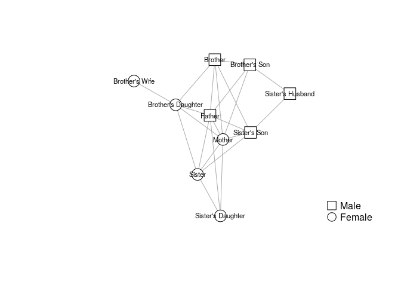

<!-- README.md is generated from README.Rmd. Please edit that file -->

# `netseg`: Measures of Network Segregation and Homophily

<!-- badges: start -->

<!-- badges: end -->

This package implements most important descriptive measures of homophily
and segregation in social networks. See Bojanowski & Corten (2014) for a
review.

## Installation

<!--
You can install the released version of netseg from [CRAN](https://CRAN.R-project.org) with:

``` r
install.packages("netseg")
```
-->

The development version from [GitHub](https://github.com/) with:

``` r
# install.packages("remotes")
remotes::install_github("mbojan/netseg")
```

## Example

To illustrate, consider the network below which comes from White (1975)

``` r
library(netseg)
library(igraph)
#> 
#> Attaching package: 'igraph'
#> The following objects are masked from 'package:stats':
#> 
#>     decompose, spectrum
#> The following object is masked from 'package:base':
#> 
#>     union

data("WhiteKinship")

plot(
  WhiteKinship,
  vertex.color = "white",
  vertex.shape = c("circle", "square")[match(V(WhiteKinship)$gender, c("female", "male"))]
)
```



The extent of segregation in this network can be assessed using one of
the indices provided in the package, for example:

``` r
# network-level
freeman(WhiteKinship, "gender")
#> [1] 0.2636364

# node-level
ssi(WhiteKinship, "gender")
#>         1         2         3         4         5         6         7         8 
#> 0.3784935 0.4923020 1.0448612 0.4793474 0.6327077 0.4053925 0.5297216 1.0159465 
#>         9        10 
#> 0.7420267 0.5936214
```

## References

Bojanowski, M., & Corten, R. (2014). Measuring segregation in social
networks. *Social Networks*, 39, 14-32.

White, D. R. (1975) “Communicative Avoidance in Social Networks”.
University of California, Irvine. (mimeo)
