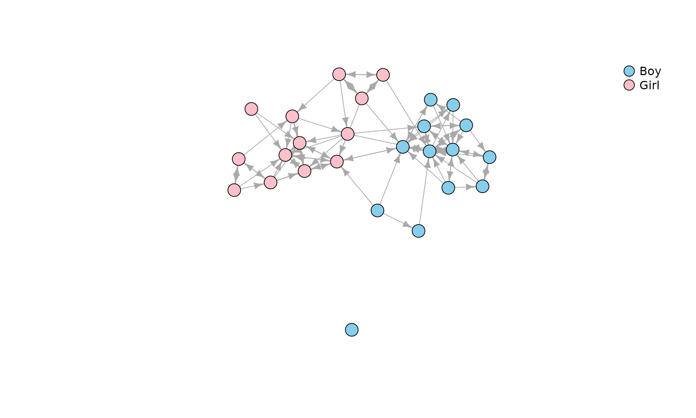
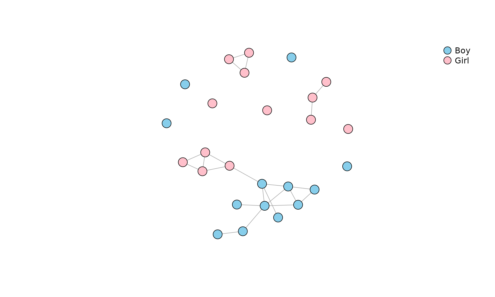
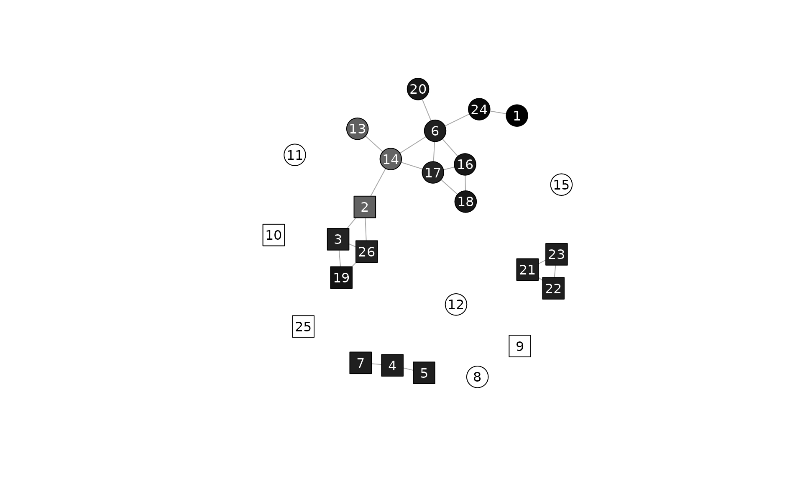

# Network Segregation and Homophily

The following vignette demonstrates using the functions from package
**netseg** (Bojanowski 2021). Two example datasets are described in the
next section. Mixing matrices are described in section 2 and the
measures are described in section 3. Please consult Bojanowski and
Corten (2014) for further details.

## Data

``` r

data(Classroom)
```

In the examples below we will use data `Classroom`, a directed network
in a classroom of 26 kids (Dolata, n.d.). Ties correspond to nominations
from a survey question “With whom do you like to play with?”. Here is a
picture:

``` r

plot(
  Classroom,
  vertex.color = c("Skyblue", "Pink")[match(V(Classroom)$gender, c("Boy", "Girl"))],
  vertex.label = NA,
  vertex.size = 10,
  edge.arrow.size = .7
)
legend(
  "topright",
  pch = 21,
  legend = c("Boy", "Girl"),
  pt.bg = c("Skyblue", "Pink"),
  pt.cex = 2,
  bty = "n"
)
```



For us it will be a graph $`G = <V, E>`$ where the node-set
$`V = \{1, ..., i, ..., N\}`$ correspond to kids, and edges $`E`$
correspond to “play-with” nominations. Additionally, we need a node
attribute, say $`X`$, exhaustivelty assigning nodes to
mutually-exclusive $`K`$ groups. In the classroom example $`X`$ is
gender with values “Boy” and “Girl” (so $`K=2`$).

Some measures are applicable only to an undirected network. For that
purpose let’s create an undirected network of reciprocated nominations
in the `Classroom` network and call it `undir`:

``` r

undir <- as.undirected(Classroom, mode="mutual")
#> Warning: `as.undirected()` was deprecated in igraph 2.1.0.
#> ℹ Please use `as_undirected()` instead.
#> This warning is displayed once per session.
#> Call `lifecycle::last_lifecycle_warnings()` to see where this warning was
#> generated.
plot(
  undir,
  vertex.color = c("Skyblue", "Pink")[match(V(undir)$gender, c("Boy", "Girl"))],
  vertex.label = NA,
  vertex.size = 10,
  edge.arrow.size = .7
)
legend(
  "topright",
  pch = 21,
  legend = c("Boy", "Girl"),
  pt.bg = c("Skyblue", "Pink"),
  pt.cex = 2,
  bty = "n"
)
```



## Mixing matrix

Mixing matrix is traditionally a two-dimensional cross-classification of
edges depending on group membership of the adjacent nodes. A
three-dimensional version of a mixing matrix cross-classifies all the
*dyads* according to the following criteria:

1.  Group membership of the ego
2.  Group membership of the alter
3.  Whether or not ego and alter are directly connected

Formally, mixing matrix is a matrix $`M`$ in which entry $`m_{ghy}`$ is
a number of pairs of nodes such that

- The first node belongs to group $`g`$
- The second node belongs to group $`h`$
- $`y`$ is `TRUE` if there is a tie, $`y`$ is `FALSE` if there is no tie

We can compute the mixing matrix for the classroom network and attribute
`gender` with the function
[`mixingm()`](https://mbojan.github.io/netseg/reference/mixingm.md). By
default the traditional two-dimensional version is returned:

``` r

mixingm(Classroom, "gender")
#>       alter
#> ego    Boy Girl
#>   Boy   40    2
#>   Girl   5   41
```

Among other things we see that:

- There are $`40 + 41 = 81`$ ties within groups.
- There are only $`5 + 2 = 7`$ ties between groups.

Supplying argument `full=TRUE` the function will return an
three-dimensional array cross-classifying the dyads:

``` r

m <- mixingm(Classroom, "gender", full=TRUE)
m
#> , , tie = FALSE
#> 
#>       alter
#> ego    Boy Girl
#>   Boy  116  167
#>   Girl 164  115
#> 
#> , , tie = TRUE
#> 
#>       alter
#> ego    Boy Girl
#>   Boy   40    2
#>   Girl   5   41
```

We can analyze the mixing matrix as a typical frequency crosstabulation.
For example:

- What is the probability of a tie depending on attributes of nodes?

``` r

round( prop.table(m, c(1,2)) * 100, 1)
#> , , tie = FALSE
#> 
#>       alter
#> ego     Boy Girl
#>   Boy  74.4 98.8
#>   Girl 97.0 73.7
#> 
#> , , tie = TRUE
#> 
#>       alter
#> ego     Boy Girl
#>   Boy  25.6  1.2
#>   Girl  3.0 26.3
```

- What is the distribution of group memberships of alters depending on
  the attribute of ego?

``` r

round( prop.table(m[,,2], 1 ) * 100, 1)
#>       alter
#> ego     Boy Girl
#>   Boy  95.2  4.8
#>   Girl 10.9 89.1
```

In other words, boys are 95% of nominations of other boys, but only 11%
of nominations of girls.

Function
[`mixingm()`](https://mbojan.github.io/netseg/reference/mixingm.md)
works also for undirected networks, values below the diagonal are always
0:

``` r

mixingm(undir, "gender")
#>       ego
#> alter  Boy Girl
#>   Boy   11    1
#>   Girl   0   10
mixingm(undir, "gender", full=TRUE)
#> , , tie = FALSE
#> 
#>       ego
#> alter  Boy Girl
#>   Boy   67  168
#>   Girl   0   68
#> 
#> , , tie = TRUE
#> 
#>       ego
#> alter  Boy Girl
#>   Boy   11    1
#>   Girl   0   10
```

Most of the segregation indexes described below summarize the mixing
matrix.

### Mixing data frames

Function
[`mixingdf()`](https://mbojan.github.io/netseg/reference/mixingm.md)
returns the same data in the form of a data frame. For directed
`Classroom` network:

``` r

mixingdf(Classroom, "gender")
#>    ego alter  n
#> 1  Boy   Boy 40
#> 2 Girl   Boy  5
#> 3  Boy  Girl  2
#> 4 Girl  Girl 41
mixingdf(Classroom, "gender", full=TRUE)
#>    ego alter   tie   n
#> 1  Boy   Boy FALSE 116
#> 2 Girl   Boy FALSE 164
#> 3  Boy  Girl FALSE 167
#> 4 Girl  Girl FALSE 115
#> 5  Boy   Boy  TRUE  40
#> 6 Girl   Boy  TRUE   5
#> 7  Boy  Girl  TRUE   2
#> 8 Girl  Girl  TRUE  41
```

For `undir`:

``` r

mixingdf(undir, "gender")
#>   alter  ego  n
#> 1   Boy  Boy 11
#> 3   Boy Girl  1
#> 4  Girl Girl 10
mixingdf(undir, "gender", full=TRUE)
#>   alter  ego   tie   n
#> 1   Boy  Boy FALSE  67
#> 3   Boy Girl FALSE 168
#> 4  Girl Girl FALSE  68
#> 5   Boy  Boy  TRUE  11
#> 7   Boy Girl  TRUE   1
#> 8  Girl Girl  TRUE  10
```

## Measures

### Assortativity coefficient

``` r

assort(Classroom, "gender")
#> [1] 0.8408885
assort(undir, "gender")
#> [1] 0.9089027
```

### Coleman’s homophily index

Coleman’s index compares the distribution of group memberships of alters
with the distribution of group sizes. It captures the extent the
nominations are “biased” due to the preference for own group.

- We have a separate value for each group
- Values are in \[-1; 1\]
  - 0 – Members of the given group nominate their group peers
    proportionally to the relative group size.
  - 1 – All nominations are from own group.
  - -1 – All nominations are from groups other than own.

``` r

coleman(Classroom, "gender")
#>       Boy      Girl 
#> 0.9084249 0.7909699
```

Values are close to 1 (high segregation). The value for boys is greater
than for girls, so girls nominated boys a bit more often than boys
nominated girls.

### E-I

``` r

ei(Classroom, "gender")
#> [1] -0.8409091
ei(undir, "gender")
#> [1] -0.9090909
```

### Freeman’s segregation index

Is applicable to undirected networks with two groups.

- Values in \[0;1\]

Function `freeman`:

``` r

freeman(undir, "gender")
#> [1] 0.9125874
```

### Gupta-Anderson-May

``` r

gamix(Classroom, "gender")
#> [1] 0.9518002
gamix(undir, "gender")
#> [1] 0.9089027
```

### Odds-ratio

``` r

orwg(Classroom, "gender")
#> [1] 16.58071
orwg(undir, "gender")
#> [1] 26.13333
```

### Segregation Matrix Index

``` r

smi(Classroom, "gender")
#>       Boy      Girl 
#> 0.9117647 0.9138241
```

### Spectral segregation index

Values for vertices

``` r

(v <- ssi(undir, "gender"))
#>         1         2         3         4         5         6         7         8 
#> 1.1392193 0.7033670 0.9816498 1.0000000 1.0000000 0.9973715 1.0000000 0.0000000 
#>         9        10        11        12        13        14        15        16 
#> 0.0000000 0.0000000 0.0000000 0.0000000 0.7151930 0.6925726 0.0000000 1.0333177 
#>        17        18        19        20        21        22        23        24 
#> 0.9701057 1.0344291 1.0550505 1.0299471 1.0000000 1.0000000 1.0000000 1.1031876 
#>        25        26 
#> 0.0000000 0.9816498
```

Plotted with grayscale (the more segregated the darker the color):

``` r

kol <- gray(scales::rescale(v, 1:0))
plot(
  undir,
  vertex.shape = c("circle", "square")[match(V(undir)$gender, c("Boy", "Girl"))],
  vertex.color = kol,
  vertex.label = V(undir),
  vertex.label.color = ifelse(apply(col2rgb(kol), 2, mean) > 125, "black", "white"),
  vertex.size = 15,
  vertex.label.family = "sans",
  edge.arrow.size = .7
)
```



## References

Bojanowski, Michał. 2021. *Measures of Network Segregation and
Homophily*. <https://mbojan.github.io/netseg/>.

Bojanowski, Michał, and Rense Corten. 2014. “Measuring Segregation in
Social Networks.” *Social Networks* 39: 14–32.
<https://doi.org/10.1016/j.socnet.2014.04.001>.

Dolata, Roman, ed. n.d. *Czy Szkoła Ma Znaczenie? Zróżnicowanie Wyników
Nauczania Po Pierwszym Etapie Edukacyjnym Oraz Jego Pozaszkolne i
Szkolne Uwarunkowania*. Vol. 1. Instytut Badań Edukacyjnych.
